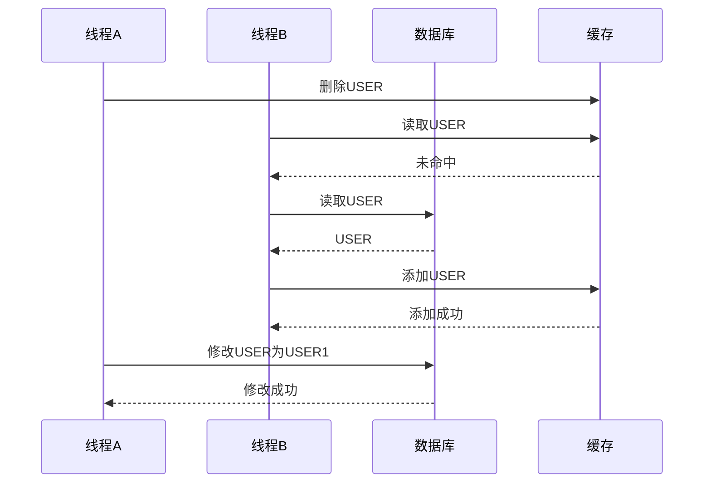
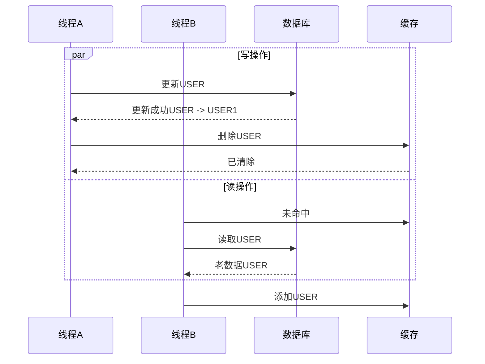

# 缓存更新策略

1. 先删除缓存在修改数据库
2. 先修改数据库后删除缓存
3. 先修改缓存后修改数据库
4. 先修改数据库后修改缓存
5. 协议代理
6. 后写模式

### 先删除缓存后读取数据库

当前模式显然存在问题，大致的流程如下：

在这种情况下，最后缓存中的数据为USER但是数据库中的数据为USER1，这就出现了数据不一致的问题，并且会一直持续到下一次更新缓存，否则一直都是脏数据。

### 先修改数据后删除缓存

这种策略是目前用的比较多的，当然，也会存在数据的不一致问题，具体的流程如下：

以上这种情况出现缓存不一致有以下几个条件：

1. 读操作的时候未命中缓存
2. 存在一个并发的线程修改当前数据
3. 数据库读操作比写操作慢
4. 读操作查询数据早写操作

以上四条同时满足的情况少之又少，最明显的一个原因如下：一般情况写操作不会比读操作慢，并且在写数据的时候会加锁。

