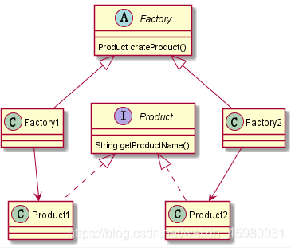
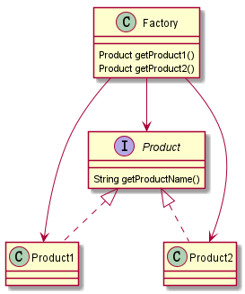
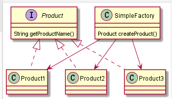

# 工厂模式

>对于工厂模式的几种类型以及他们的实现方法，在此做一个总结。
>另外就是我在网上对于同一种名称的工厂，找到了好几种不同的实现方法。看了一下，发现其实大同小异，只是名字不同，具体思想还是这三种。
>在这里我只写我认为对的。

首先是简单工厂，就是创建一个类，实现一个方法，传入参数，根据参数创建对应的产品。

工厂方法，我任务重点就在方法两个字上面，所以下面的就是创建一个类，实现多个方法，每个方法创建不同的产品，需要创建那个产品，就调用那个方法。

工厂方法对工厂中创建产品的方法使用static修饰就是静态工厂方法模式。

抽象工厂模式：这个我认为重点是对于工厂的一个抽象，将工厂抽象成一个抽象类，然后不同的实现类创建不同的产品。

总结，个人感觉这些东西的名字其实并没有那么重要，关键在于其中的思想。将这几种工厂相互组合起来又能够得到另一个不一样的模式。会用才是关键。

## 简单工厂


简单工厂把所有的实例化操作单独放在一个类中，这个类就成功了简单工厂类，让简单工厂类决定将那个具体的子类实例化。

这样做可以把客户类和具体的子类的实现解耦，客户类无需知道有哪些子类和怎样去创建子类；他只需要告诉工厂，我需要什么就可以了。好处是当子类发生了改变的时候不需要对客户类做出改变。但是这种方法也违背了开闭原则，因为你在增加工厂可以初始化的类的时候，必须对工厂进行改变。

```java
public interface Product {
    public String getProductName();
}
```

```java
public class ServiceProduct1 implements Product{
    public ServiceProduct1() {

    }

    @Override
    public String getProductName() {
        return "product1";
    }
}
```

```java
public class ServiceProduct2 implements Product{
    public ServiceProduct2() {

    }

    @Override
    public String getProductName() {
        return "product2";
    }
}
```

```java
public class ServiceProduct3 implements Product{
    public ServiceProduct3() {

    }

    @Override
    public String getProductName() {
        return "product3";
    }
}
```

```java
public class SimpleFactory {

    public SimpleFactory() {
    }

    public Product creatProduct(int type) {
        if (type == 1) {
            return new ServiceProduct1();
        }else if (type == 2) {
            return new ServiceProduct2();
        }else if (type == 3) {
            return new ServiceProduct3();
        }
        return null;
    }
}

```

## 工厂方法

工厂方法就是将创建产品由原先的一个方法分成一个个的具体的方法，想要创建某个产品的时候就直接调用相应的方法就可以了。

另外就是在进行增加功能的时候，直接增加一个方法，然后创建新增加的产品就可以了。


再说一点就是，将每个创建产品的方法用static修饰，这就是静态工厂方法。


```java
public class Factory {

    public Product getProduct1() {
        return new Product1();
    }

    public Product getProduct2() {
        return new Product1();
    }
}
```

```java
public interface Product {
    String getProductName();
}
```

```java
public class Product1 implements Product{
    @Override
    public String getProductName() {
        return null;
    }
}
```

## 抽象工厂


在简单工厂方法中，具体的产品类是由工厂方法直接产生的，这样就导致了当产品修改的时候，工厂也需要进行修改。而工厂方法则把具体的生产产品的任务交给其实现的具体方法，工厂本身只是提供一个统一的标准。

```java
public abstract class Factory {
     public abstract Product creatProduct();
}
```

```java
public class Factory1 extends Factory{

    @Override
    public Product creatProduct() {
        return new ServiceProduct1();
    }
}
```
```java
public class Factory2 extends Factory{

    @Override
    public Product creatProduct() {
        return new ServiceProduct2();
    }
}
```

```java
public class Factory3 extends Factory{

    @Override
    public Product creatProduct() {
        return new ServiceProduct3();
    }
}
```
